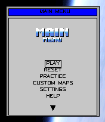
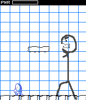
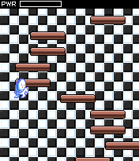
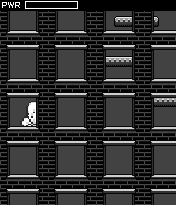
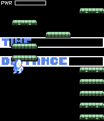
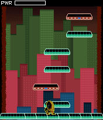

# Mad Kaz

**Description**: Submission to the 2007 MOTODEV gamedev challenge. Included are the SDK tools (alpha), level scripts (beta), and the game engine (beta). Due to the time contraints, there aren't many comments in the code. Also, in an effort to increase the framerate, some of the code has been restructured and manually inlined (spaghetti code). The engine was designed to run on the Motorola K1, but has also been tested on many other phones that have a screen width of 176 pixels (e.g. Samsung SGH-D520).

* /madkaz contains the game engine.
* /madkazsdk contains the SDK tools (Assembler, HersheyFontConverter, BrowsableStructureCreator, DownloadableLevelWrapper, and IndexedCombiner).
* /madkazlevels contains the game's levels (scripts).

**Official Entry Description**: Mad Kaz is a vertical platformer where you lead the title character through a series of unique levels, each crazier than the last. Mad Kaz features six zones with between four to ten levels per zone, and eight different game modes.  Built on top of a unique engine, Mad Kaz allows users to create their own levels with customized game play, cinematics, music, and style.  Levels can be uploaded onto phones via either Bluetooth or the Internet.

      

**License:** Public domain.
